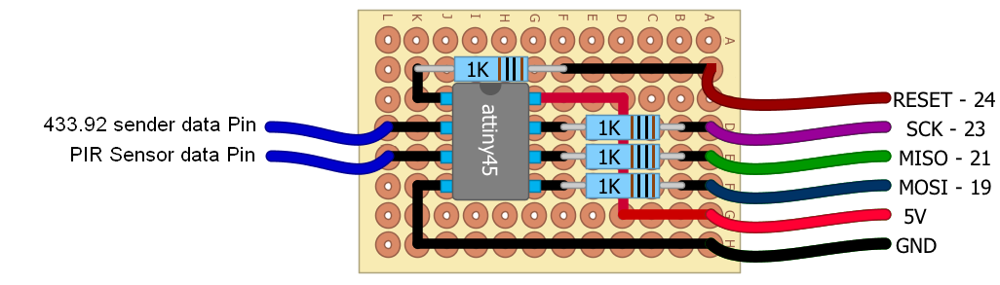

Wireless 433mhz PIR sensor for attiny45
=============
This code is based on the work from Sweetpi and with the help from Mercuri0

https://github.com/sweetpi

!!!!!!!!!!!!!THIS PROJECT IS FOR TESTING PURPOSES!!!!!!!!!!!!!!!!

This is a wireless passive infrared sensor for the raspberry build with an attiny45.
It will send a 433 mhz (custom) signal when movement is detected. 
You can use i.e. pilight (http://www.pilight.org) to perform the nessasarry action when a signal is send.
WARNING: this could potentionally damage your raspberry pi and also other hardware. I take no responsability for any damages! Try at your own risk!

1. Install avrgcc:
------------------
	sudo apt-get install gcc-avr avr-libc

2. Install modified avrdude:
-------------------
	wget http://project-downloads.drogon.net/files/avrdude_5.10-4_armhf.deb
	wget http://project-downloads.drogon.net/files/avrdude-doc_5.10-4_all.deb
	sudo dpkg -i avrdude_5.10-4_armhf.deb
	sudo dpkg -i avrdude-doc_5.10-4_all.deb

3. Compile and program attiny:
------------------------------
	make all
	make program
	

Additional info:
----------------
###Calculate fuses:
	http://www.engbedded.com/fusecalc/

###Pinout:
	
Down below a schematic how I use my attiny45, PIR Sensor and 433mhz sender.
	
        ![Pinout attiny 45] (docs/attiny45_85pinout.png  "Pinout attiny 45")

|  Name     | Raspberry Pi V2 | Attiny45 | 433 Sender  | PIR Sensor |
|-----------|-----------------|----------|-------------|------------|
|  MOSI     |       19        |    5     |      -      |     -      |
|  MISO     |       21        |    6     |      -      |     -      |
|  SCK      |       23        |    7     |      -      |     -      |
| RESET     |       24        |    1     |      -      |     -      |
| TRANS_PIN |       -         |    3     |     DATA    |     -      |
| INPUT_PIN |       -         |    4     |      -      |    DATA    |

to change the pins create an .avrduderc file in your home directory containing (the numbering is wiringpi numbering!):

	programmer
		id    = "gpio";
		desc  = "Use sysfs interface to bitbang GPIO lines";
		type  = gpio;
		reset = 8;
		sck   = 11;
		mosi  = 10;
		miso  = 9;
	;

